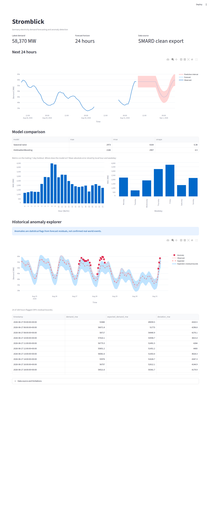

# Stromblick

[](https://github.com/jyotishmanh07/stromblick/actions/workflows/ci.yml)

**Germany Electricity Demand Forecasting & Anomaly Detection**

Stromblick forecasts Germany's electricity demand for the next 24 hours and highlights unusually high or low demand. It demonstrates data validation, time-series feature engineering, chronological evaluation, statistical reasoning, Python, an API, a dashboard, automated tests, and Docker.

## Product question

Given all demand observed up to a timestamp, what demand should we expect during each of the next 24 hours? Which observations are unusually far above or below the expected value?

The target is hourly demand in MW. Statistical anomalies are investigation prompts, not confirmed events or causal explanations.

## Method

The repository compares exactly three model levels:

1. **Seasonal naive:** same hour on the previous day, with a previous-week fallback.
2. **SARIMAX:** an interpretable statistical baseline with daily seasonality.
3. **HistGradientBoostingRegressor:** the main scikit-learn model using hour, weekday, month, German public-holiday and DST-transition flags, lagged demand (1h/24h/168h), and trailing means (24h/7d).

`rolling_origin_backtest` evaluates future windows chronologically. Model selection belongs on validation origins; a final holdout should be passed only after that choice is made. Metrics are MAE, RMSE, and sMAPE, with error slices by hour, weekday, month, and holiday status. Residual intervals and anomaly bounds are estimated from validation residuals.

Every lag and rolling feature is shifted first, so current or future demand cannot leak into a training row. DST-aware timestamps are normalized to UTC; naive source timestamps are interpreted as Europe/Berlin.

## Data

The source is the German Federal Network Agency's SMARD electricity-market platform, module 410 (Germany actual total grid load), read through the official chart-data API:

```bash
PYTHONPATH=src python scripts/ingest_smard_api.py --weeks 52
```

The client reads the weekly index at `https://www.smard.de/app/chart_data/410/DE/index_hour.json`, then pulls each weekly chunk (`.../410_DE_hour_<epoch_ms>.json`). Payload values are average-interval demand in MW at epoch-millisecond timestamps; they are converted to UTC hourly observations with columns `timestamp` and `demand_mw`. It defaults to the latest 52 weekly chunks (`--weeks` to change).

Every raw index/chunk response is written to `data/raw/`, canonical hourly demand to `data/clean/demand_hourly.csv`, and provenance (source URLs, collection time, row count, snapshot bounds) to `data/clean/metadata.json`. Missing hourly timestamps are reported, never imputed. `data/` is not tracked in git except for `metadata.json`; re-run the ingest command to rebuild the dataset.

Attribute the data to **Bundesnetzagentur | SMARD.de** under **CC BY 4.0**. SMARD may revise historical grid-load values, so a published result should cite the collected snapshot recorded in `metadata.json`.

The API and dashboard fall back to deterministic synthetic demo data when the clean file is absent. This keeps local smoke tests reproducible; it is not a substitute for official data in a published analysis.

## Dashboard



The Streamlit dashboard shows the 24-hour forecast with its residual interval band, a seasonal-naive vs. gradient-boosting comparison on the trailing week with error slices by local hour and weekday, and an anomaly explorer that marks hours whose deviation from the expected value leaves the 99% validation-residual bounds. Anomaly bounds are learned from the week *before* the scored window, so they never see the data they score.

## Run locally

```bash
python -m venv .venv
source .venv/bin/activate
pip install -e ".[dev]"
pytest -q
uvicorn energy_forecast.api:app --reload
streamlit run app/streamlit_app.py
```

API examples:

```bash
curl http://localhost:8000/health
curl -X POST http://localhost:8000/forecast \
  -H 'content-type: application/json' \
  -d '{"as_of":"2026-08-28T00:00:00Z","horizon_hours":24}'
```

`POST /forecast` requires a timezone-aware ISO timestamp and accepts horizons from 1 through 24 hours. The response always includes UTC timestamps, point predictions, and symmetric residual-based interval bounds.

## Docker

```bash
docker compose up --build
```

The FastAPI service is at `http://localhost:8000`; the Streamlit dashboard is at `http://localhost:8501`.

## Limitations and next work

- Demand-only features are the first baseline. Renewable generation, temperature, wind, and solar forecasts should be added only after the demand-only comparison is stable.
- The bundled interval is empirical, based on historical validation residual magnitudes; it is not a calibrated probabilistic forecast.
- SMARD licensing, export shape, revision policy, and availability should be documented for the exact dataset snapshot used in a published analysis.
- A production version should add scheduled ingestion, persistent model artifacts, monitoring, weather covariates, and a final untouched test report.
