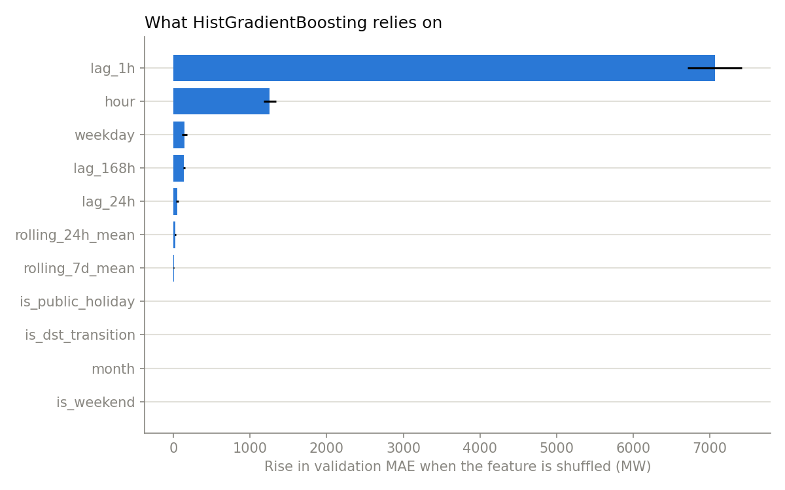
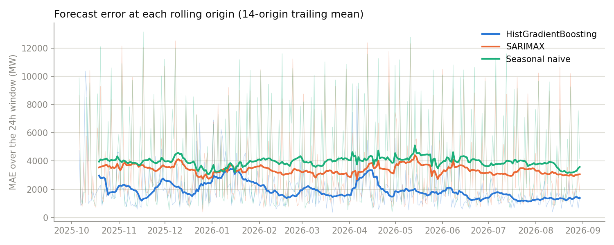
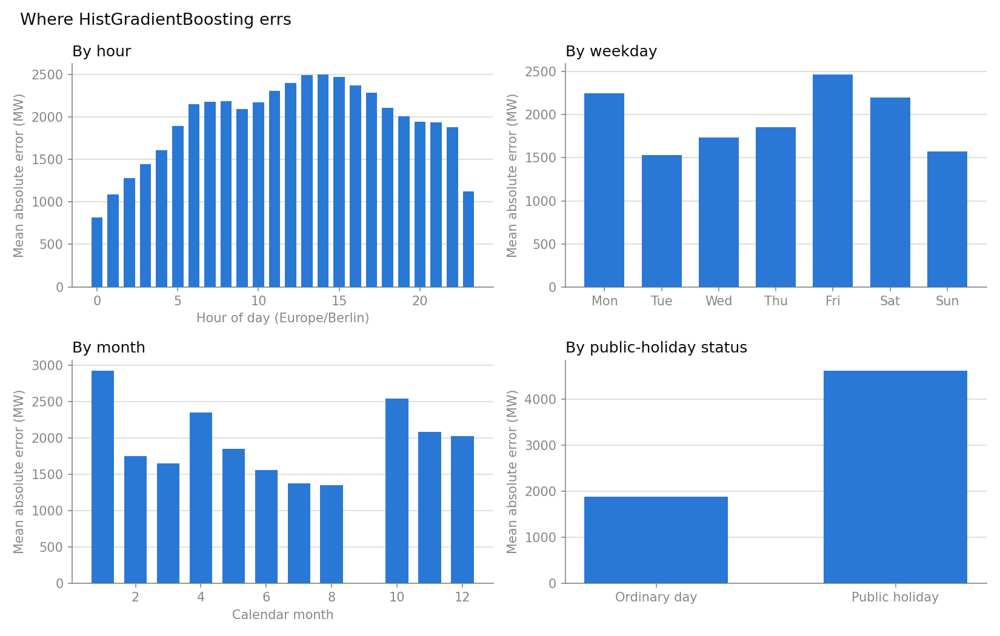

# Model benchmark

Snapshot: `2025-09-07 22:00:00+00:00` to `2026-08-31 07:00:00+00:00` (8,578 hourly rows). Source: Bundesnetzagentur | SMARD.de, module 410 (Germany actual total grid load), CC BY 4.0.

Rolling-origin backtest: **329 origins** spaced 24h apart, the first after 28 days of history. Each origin trains on all data up to that point and is scored on the next 24 hours; every model is refit at every origin. Evaluation spans `2025-10-05 22:00:00+00:00` to `2026-08-30 21:00:00+00:00` (7,882 forecast hours). No random split is used, and every feature lag is shifted so no training row can see its own or a future value.

## Headline metrics

| Model | MAE (MW) | RMSE (MW) | sMAPE (%) | MAE vs seasonal-naive |
|---|---|---|---|---|
| Seasonal naive | 3,935 (±3,349) | 4,487 | 7.47 | — |
| SARIMAX | 3,366 (±2,883) | 3,991 | 6.30 | -14.4% |
| HistGradientBoosting | 1,944 (±1,366) | 2,350 | 3.56 | -50.6% |

MAE and RMSE are the mean across origins; the value in parentheses is the MAE standard deviation across origins, i.e. how much the error swings from window to window. Lower is better on every column.

**HistGradientBoosting** has the lowest error, cutting MAE by **50.6%** against the seasonal-naive baseline (1,944 vs 3,935 MW). The baseline is the honest yardstick: a model that cannot beat "same hour yesterday, last week as fallback" is not earning its complexity.

## Prediction-interval coverage

The shipped interval is HistGradientBoosting's forecast ± the 95th percentile of absolute residuals from *earlier* origins (the same recipe the service uses). Walking that band forward across 7,810 scored hours, **93.2%** of observed values land inside it against a 95% nominal target, at a mean band width of 11,150 MW. This is an empirical magnitude band, not a calibrated probabilistic interval.

## What HistGradientBoosting relies on



Permutation importance on a held-out trailing validation week: each bar is how much the validation MAE rises when that column is shuffled. The three that matter most are `lag_1h` (7,064 MW), `hour` (1,258 MW), `weekday` (145 MW).

## Error at each origin



Per-origin MAE over the whole backtest. A model is only trustworthy if it wins consistently, not just on average.

## Where HistGradientBoosting errs



MAE for HistGradientBoosting broken down by local hour, weekday, calendar month, and German public-holiday status. The largest hourly error falls at hour 14 (Europe/Berlin). On public holidays the champion's MAE is 4,619 MW versus 1,878 MW on ordinary days.

## Model configuration

The gradient-boosting settings in `models.py` (`learning_rate=0.06`, `max_iter=250`, `max_leaf_nodes=31`, `l2_regularization=1.0`) were checked with a seven-config rolling-origin sweep over 30 daily origins, varying learning rate (0.03–0.10), tree count (150–500), leaf count (15–63), and L2 penalty (0.1–1.0). Mean 24-hour MAE moved by under 5% across every config and all of them sat inside one standard deviation of each other, so the defaults are kept: nothing in the neighbourhood beat them by a margin the backtest could resolve.

## Reproduce

```bash
PYTHONPATH=src python scripts/benchmark.py --step-hours 24
```

Per-origin metrics for every model are written to `benchmark_metrics.csv` alongside this report; the dashboard reads that file directly.
