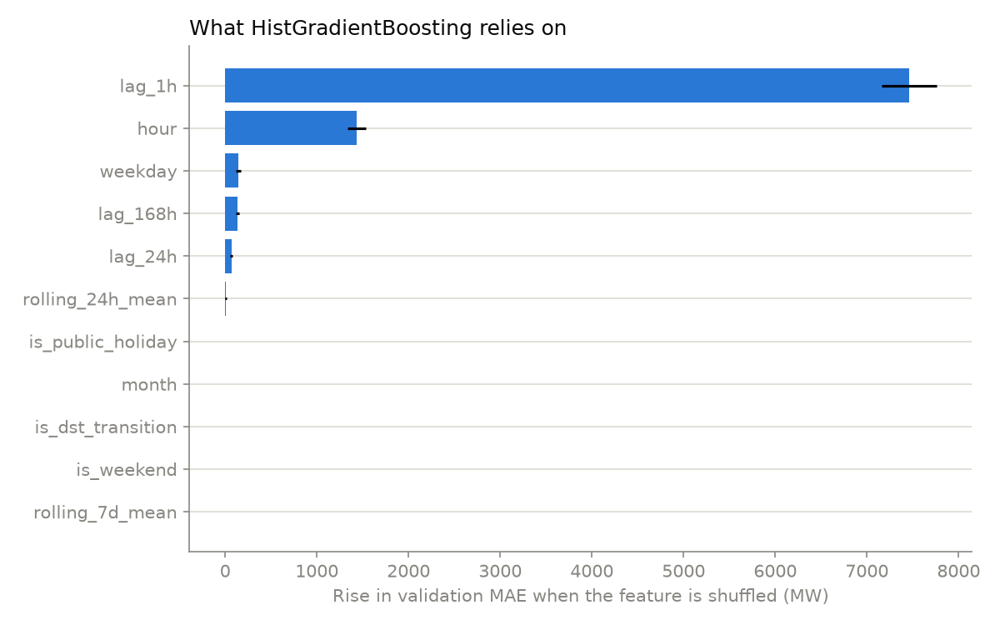
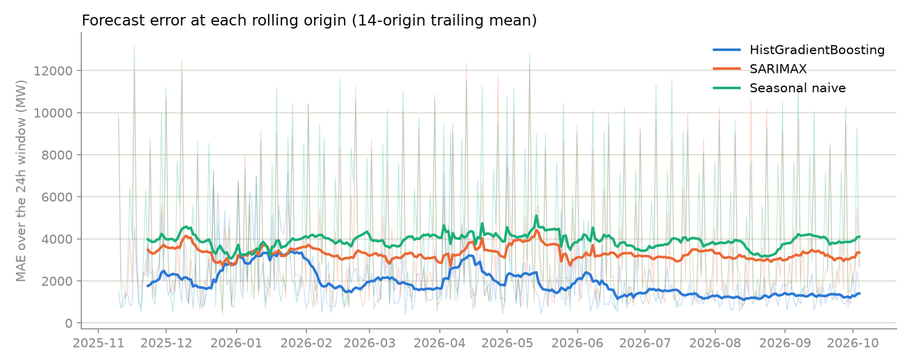
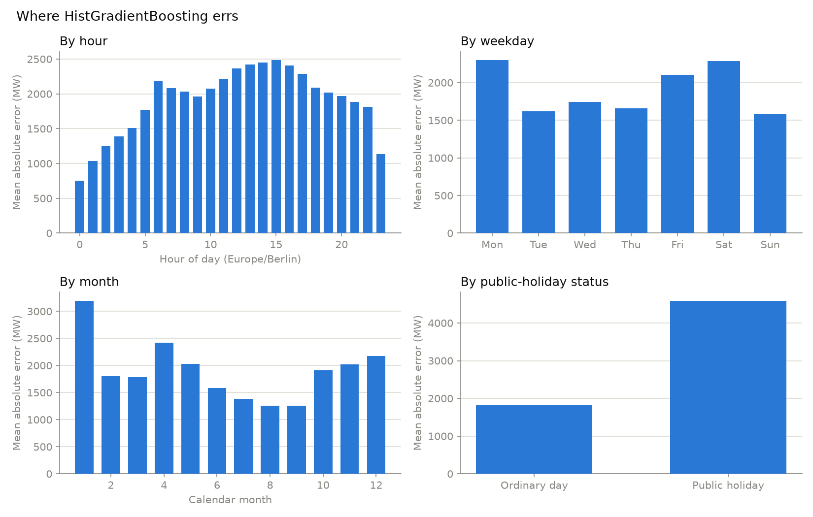

# Model benchmark

Snapshot: `2025-10-05 22:00:00+00:00` to `2026-09-30 16:00:00+00:00` (8,635 hourly rows). Source: Bundesnetzagentur | SMARD.de, module 410 (Germany actual total grid load), CC BY 4.0.

Rolling-origin backtest: **331 origins** spaced 24h apart, the first after 28 days of history. Each origin trains on all data up to that point and is scored on the next 24 hours; every model is refit at every origin. Evaluation spans `2025-11-02 22:00:00+00:00` to `2026-09-29 21:00:00+00:00` (7,944 forecast hours). No random split is used, and every feature lag is shifted so no training row can see its own or a future value.

## Headline metrics

| Model | MAE (MW) | RMSE (MW) | sMAPE (%) | MAE vs seasonal-naive |
|---|---|---|---|---|
| Seasonal naive | 3,927 (±3,318) | 4,478 | 7.51 | — |
| SARIMAX | 3,345 (±2,850) | 3,968 | 6.31 | -14.8% |
| HistGradientBoosting | 1,929 (±1,327) | 2,338 | 3.55 | -50.9% |

MAE and RMSE are the mean across origins; the value in parentheses is the MAE standard deviation across origins, i.e. how much the error swings from window to window. Lower is better on every column.

**HistGradientBoosting** has the lowest error, cutting MAE by **50.9%** against the seasonal-naive baseline (1,929 vs 3,927 MW). The baseline is the honest yardstick: a model that cannot beat "same hour yesterday, last week as fallback" is not earning its complexity.

### Is the win statistically significant?

| Comparison | Mean per-origin MAE gap (MW) | 95% CI | Wilcoxon p | DM p |
|---|---|---|---|---|
| HistGradientBoosting − Seasonal naive | -1,998 | [-2,361, -1,644] | 3.18e-22 | 1.38e-28 |
| HistGradientBoosting − SARIMAX | -1,416 | [-1,731, -1,103] | 4.62e-18 | 2.71e-20 |

Per-origin MAE across the 331 paired origins is the sampling unit: hours inside one 24-hour window share weather and demand level, so treating them as independent would overstate confidence. The CI is a paired bootstrap (10,000 resamples) on the mean difference; negative means the champion errs less. The Diebold-Mariano column tests the same claim on hourly losses with a Harvey-Leybourne-Newbold correction for 24-step serial dependence. The gap is statistically significant against both rivals, not sampling noise.

**Interval coverage:** mean per-origin coverage is 93.1% (95% CI [91.4%, 94.6%]) against the 95% nominal target across 328 origins — below the nominal target by a margin the data can resolve (p = 1.95e-02). Per-origin rates are the unit here for the same reason.

**Holiday penalty:** public-holiday hours cost 3,310 MW more absolute error than ordinary hours (95% CI [2,678, 3,959], permutation p = 2.00e-04, Cohen's d = 1.66) over 192 holiday hours against 7,752 ordinary ones. This is the clearest weakness in the champion and the first place to spend more feature work.

## Prediction-interval coverage

The shipped interval is HistGradientBoosting's forecast ± the 95th percentile of absolute residuals from *earlier* origins (the same recipe the service uses). Walking that band forward across 7,872 scored hours, **93.1%** of observed values land inside it against a 95% nominal target, at a mean band width of 11,148 MW. This is an empirical magnitude band, not a calibrated probabilistic interval.

## What HistGradientBoosting relies on



Permutation importance on a held-out trailing validation week: each bar is how much the validation MAE rises when that column is shuffled. The three that matter most are `lag_1h` (7,459 MW), `hour` (1,437 MW), `weekday` (141 MW).

## Error at each origin



Per-origin MAE over the whole backtest. A model is only trustworthy if it wins consistently, not just on average.

## Where HistGradientBoosting errs



MAE for HistGradientBoosting broken down by local hour, weekday, calendar month, and German public-holiday status. The largest hourly error falls at hour 14 (Europe/Berlin). On public holidays the champion's MAE is 5,159 MW versus 1,849 MW on ordinary days.

## Model configuration

The gradient-boosting settings in `models.py` (`max_iter=250`, `learning_rate=0.06`, `max_leaf_nodes=31`, `l2_regularization=1.0`) were checked with a **nested rolling-origin search**: 40 Optuna TPE trials scored on 12 origins drawn only from the training span, then confirmed on 60 later origins the search never saw.

The search did find a better inner score (2,573 vs 2,665 MW, -3.5%). On the held-out origins that shrank to 1,567 vs 1,587 MW (-1.3%), a mean difference of -20 MW with a 95% CI of [-82, 44] (Wilcoxon p = 0.38).

The shipped defaults are **kept**. The tuned configuration is only 1.3% better on origins the search never saw, and the confidence interval on that difference contains zero — the gain is smaller than the variation between origins. Adopting it would be fitting the search rather than improving the model.

That gap between the inner and outer numbers is the reason for the nesting. A search almost always improves the score on the data it searched; only the held-out comparison says whether anything was learned. Full detail in [tuning.md](tuning.md).

## Reproduce

```bash
PYTHONPATH=src python scripts/benchmark.py --step-hours 24
```

Per-origin metrics for every model are written to `benchmark_metrics.csv` alongside this report; the dashboard reads that file directly.
