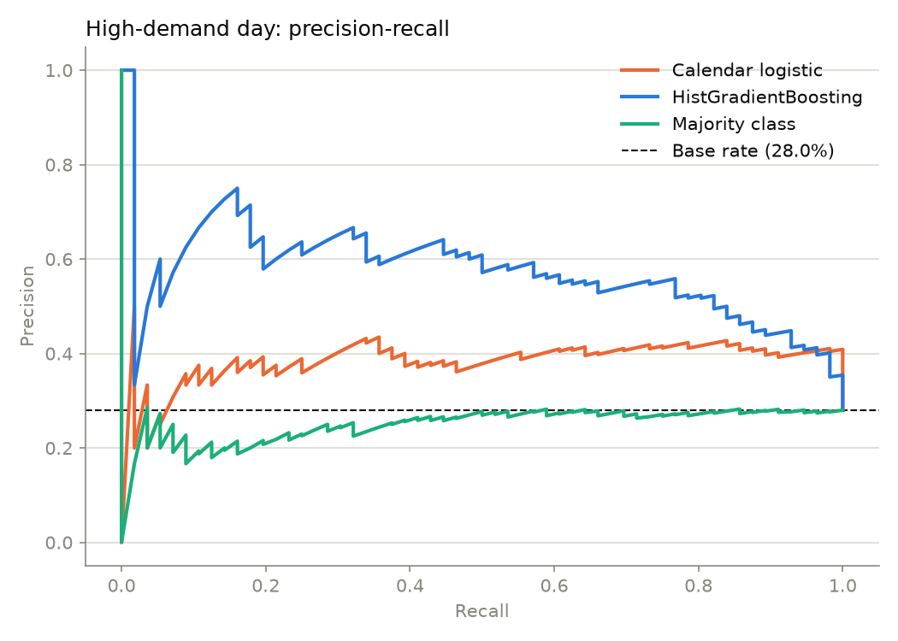
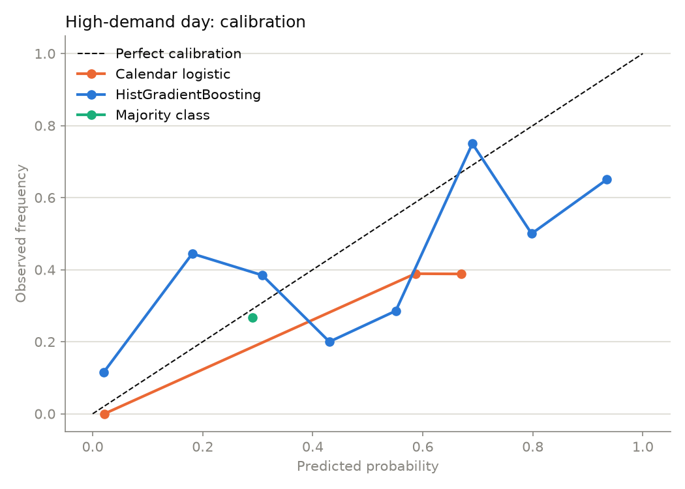
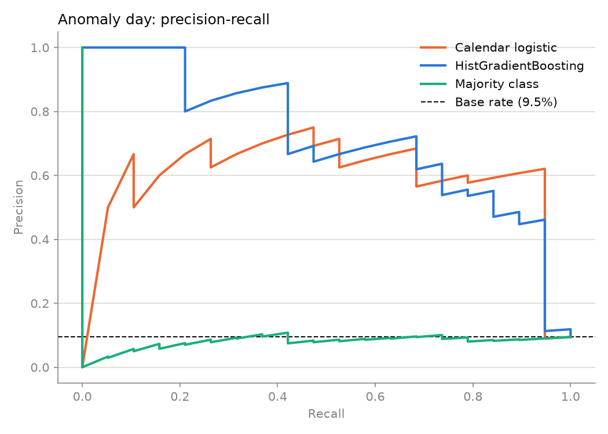
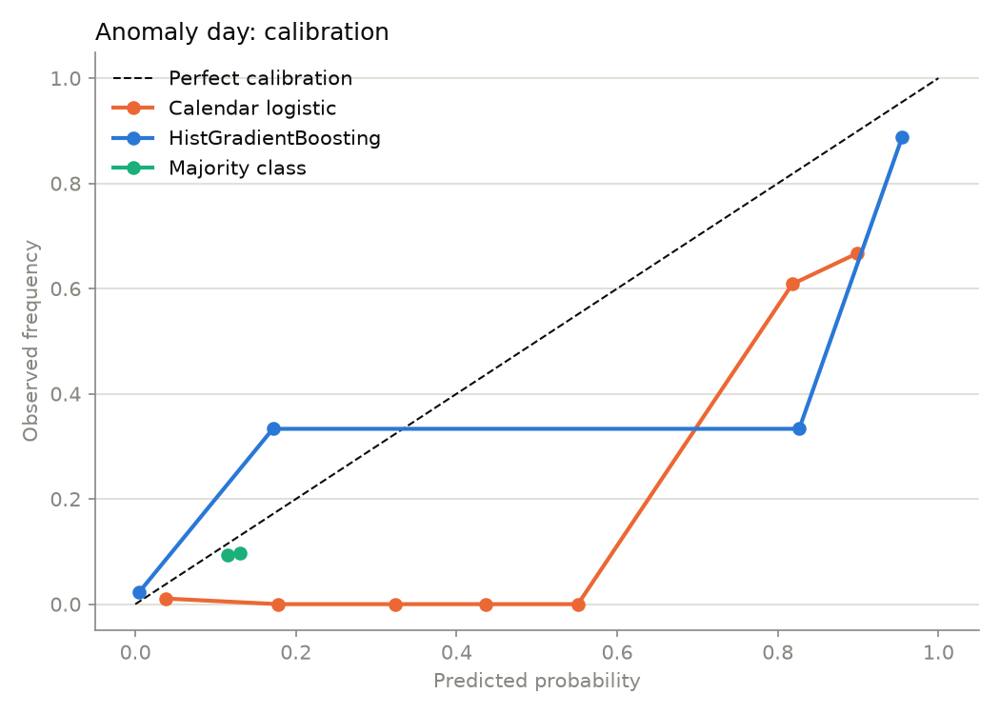

# Daily event classification

A second problem type on the same SMARD snapshot: instead of "how much demand each hour", these models answer "is tomorrow worth planning around" — the shape a reserve or staffing decision actually takes. The forecasting benchmark remains the headline result; this is a companion track.

Both targets are labelled from **past data only**. The threshold that judges a day is computed from the days before it and shifted, so the leakage rule that governs the forecasting features governs the labels too. Evaluation walks forward one day at a time, refitting every model at every origin — the classification counterpart of `rolling_origin_backtest`.

Two baselines make the comparison honest: a majority-class predictor (the floor) and a logistic regression on calendar columns alone (how far the almanac gets you without looking at demand at all).

## High-demand day

320 labelled days, 200 scored chronologically after a 120-day warm-up; every model refit at every origin. Positive rate over the scored window: 28.0% (56 days).

| Model | PR-AUC | Lift over base rate | ROC-AUC | Brier |
|---|---|---|---|---|
| HistGradientBoosting | 0.581 | 2.07× | 0.819 | 0.1789 |
| Calendar logistic | 0.396 | 1.41× | 0.708 | 0.2012 |
| Majority class | 0.258 | 0.92× | 0.461 | 0.2030 |

**HistGradientBoosting** ranks best. PR-AUC is read against the base rate, not against 0.5 — the lift column is the honest version. The majority-class row is the floor: it predicts the training positive rate for every day, so any ranking it appears to achieve is noise.





### Choosing an operating point

Assuming a missed day costs 10× a false alarm, expected cost is lowest at a threshold of **0.05** — flagging 97 days to catch 47 of 56, at 48% precision and 84% recall. That ratio is an assumption, not a measurement: change it and the operating point moves, which is the point of reporting the whole curve rather than one number.

> **This is a boundary solution.** The minimum sits at the lowest threshold searched, which means a 10:1 cost ratio against a 28% base rate is extreme enough that flagging nearly everything wins — the model is barely consulted. Read it as a statement about the assumed costs, not as a tuned threshold. A ratio below roughly 3:1 is where the decision starts depending on the model's ranking at all.

## Anomaly day

319 labelled days, 199 scored chronologically after a 120-day warm-up; every model refit at every origin. Positive rate over the scored window: 9.0% (18 days).

| Model | PR-AUC | Lift over base rate | ROC-AUC | Brier |
|---|---|---|---|---|
| HistGradientBoosting | 0.703 | 7.77× | 0.925 | 0.0493 |
| Calendar logistic | 0.538 | 5.94× | 0.910 | 0.0985 |
| Majority class | 0.083 | 0.92× | 0.445 | 0.0834 |

**HistGradientBoosting** ranks best. PR-AUC is read against the base rate, not against 0.5 — the lift column is the honest version. The majority-class row is the floor: it predicts the training positive rate for every day, so any ranking it appears to achieve is noise.





### Choosing an operating point

Assuming a missed day costs 10× a false alarm, expected cost is lowest at a threshold of **0.05** — flagging 31 days to catch 15 of 18, at 48% precision and 83% recall. That ratio is an assumption, not a measurement: change it and the operating point moves, which is the point of reporting the whole curve rather than one number.

> **This is a boundary solution.** The minimum sits at the lowest threshold searched, which means a 10:1 cost ratio against a 9% base rate is extreme enough that flagging nearly everything wins — the model is barely consulted. Read it as a statement about the assumed costs, not as a tuned threshold. A ratio below roughly 10:1 is where the decision starts depending on the model's ranking at all.

## Label design

The high-demand threshold is a trailing 30-day 70th percentile. Two stricter framings were tried first and both collapsed on a single year of strongly seasonal data:

- An **expanding all-time top decile** is set by January's peaks, so no summer day can clear it. The label degenerates into "is it winter", and an evaluation window starting after winter contains no positive days at all.
- A **trailing 60-day top decile** still empties out during sustained seasonal decline: March, April and May produced zero positives, because a falling series never exceeds its own recent upper tail.

A shorter window and a milder quantile keep every month populated. The positive rate is still not stationary — it rises when demand trends up and falls when it trends down — which is a real property of the target rather than something to smooth away.

The anomaly label uses the **seasonal-naive** deviation, `demand(t) − demand(t−24h)`, which depends on no fitted model. Labelling with the champion's own residuals would ask the classifier to predict where one particular model fails, and any evaluation of that would be circular.

## Limitations

- One year of data yields roughly 320 labelled days, and the scored window holds a few dozen positives. Confidence intervals on these metrics would be wide; treat the ranking as indicative, not settled.
- The cost ratio behind the operating point is assumed, not measured.
- No weather covariates. Temperature is the obvious missing driver for both targets.

## Reproduce

```bash
PYTHONPATH=src python scripts/benchmark_classification.py
```
