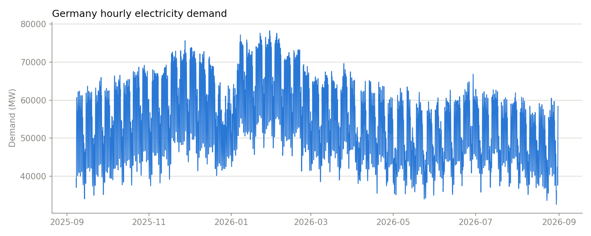
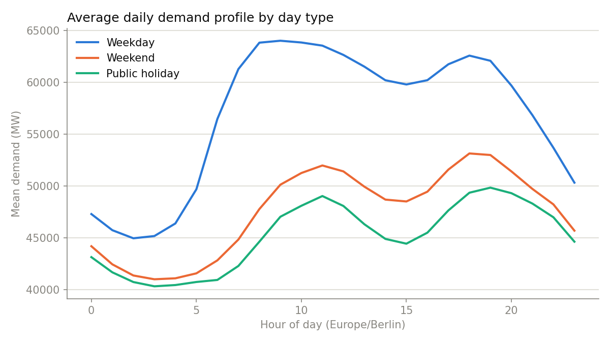
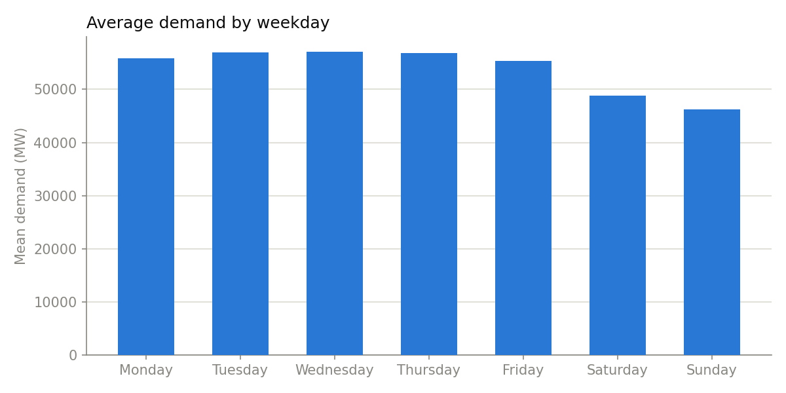
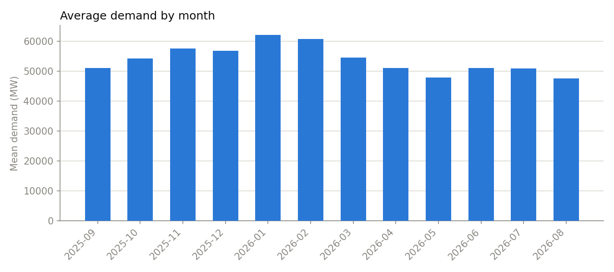

# Exploratory data analysis

Snapshot: `2025-09-07 22:00:00+00:00` to `2026-08-31 07:00:00+00:00` (8,578 hourly rows). Source: Bundesnetzagentur | SMARD.de, module 410 (Germany actual total grid load), CC BY 4.0.

- Mean demand: 53,868 MW
- Peak: 78,241 MW; trough: 32,607 MW
- Missing hourly timestamps (gaps in the index): 0
- Hours present in the index but with no demand value: 14
  - First few: 2026-08-30 06:00:00+00:00, 2026-08-30 07:00:00+00:00, 2026-08-30 08:00:00+00:00, 2026-08-30 09:00:00+00:00, 2026-08-30 10:00:00+00:00

Missing hours are reported, not imputed, matching the project's data-validation policy.

## Demand over the collected period

## Daily profile by day type

Weekday demand peaks around 64,002 MW; weekend peaks are lower (~53,132 MW) and public holidays track the weekend shape even when they fall on a weekday.

## Weekly pattern

## Monthly pattern

