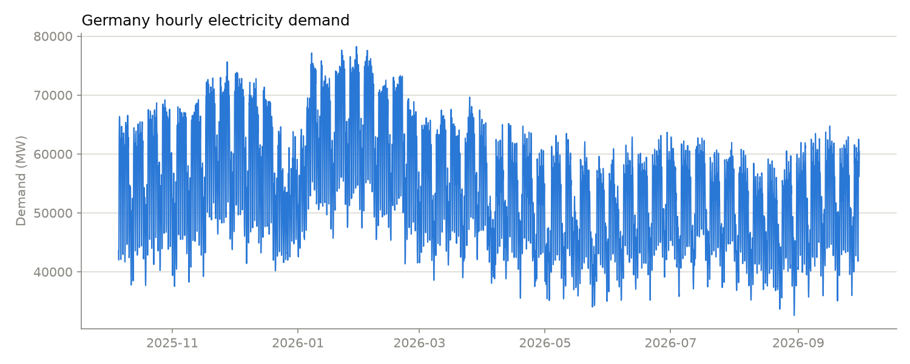
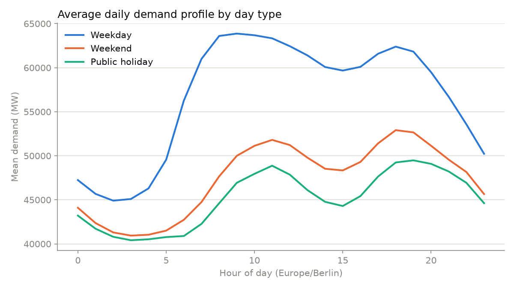
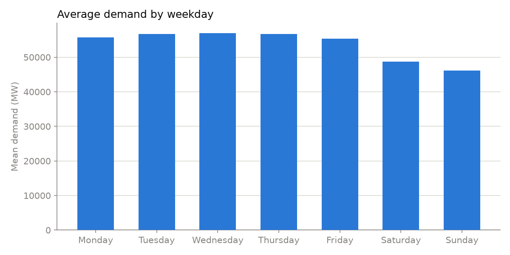
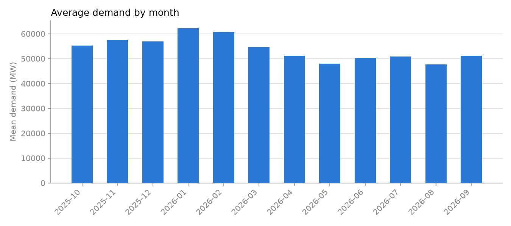

# Exploratory data analysis

Snapshot: `2025-10-12 22:00:00+00:00` to `2026-10-05 10:00:00+00:00` (8,581 hourly rows). Source: Bundesnetzagentur | SMARD.de, module 410 (Germany actual total grid load), CC BY 4.0.

Every figure below is a SQL aggregation over the DuckDB warehouse built from that snapshot (`sql/`, rebuilt by `scripts/build_warehouse.py`).

- Mean demand: 53,756 MW
- Peak: 78,241 MW; trough: 32,598 MW
- Missing hourly timestamps (gaps in the index): 0
- Hours present in the index but with no demand value: 0

Missing hours are reported, not imputed, matching the project's data-validation policy.

## Demand over the collected period

## Daily profile by day type

Weekday demand peaks around 63,853 MW; weekend peaks are lower (~52,895 MW) and public holidays track the weekend shape even when they fall on a weekday.

## Weekly pattern

## Monthly pattern

## Public holidays

Across 216 public-holiday hours mean demand is 45,319 MW against 53,974 MW on 8,365 ordinary hours — a 16% drop. Holidays are also the champion model's weakest slice; see [benchmark.md](benchmark.md).
