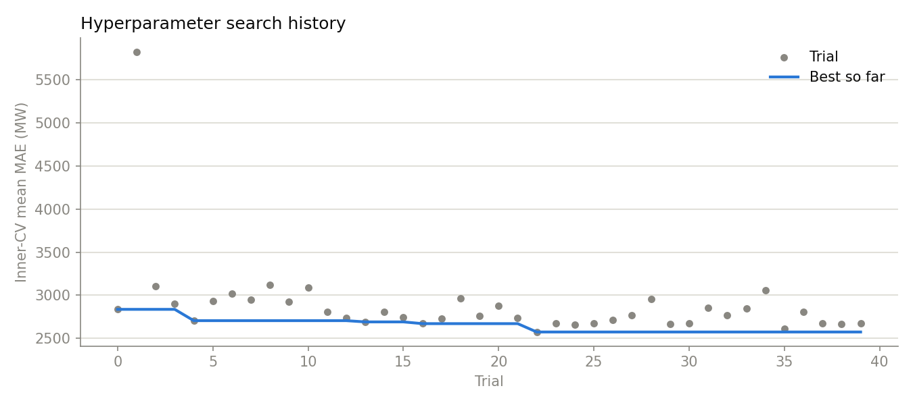

# Hyperparameter search

Optuna TPE, 40 trials, seed 42. The search is **nested**: trials are scored on 12 rolling origins drawn only from the first 70% of the snapshot, and the winner is then confirmed on 60 later origins the search never saw. A single-loop search that tuned and reported on the same origins would produce a number that cannot be trusted.

## Search space and outcome

| Parameter | Shipped default | Inner-search best |
|---|---|---|
| `l2_regularization` | 1.0 | 0.003399214253595694 |
| `learning_rate` | 0.06 | 0.05575967547629563 |
| `max_iter` | 250 | 500 |
| `max_leaf_nodes` | 31 | 23 |
| `min_samples_leaf` | — | 20 |

Best inner-CV mean MAE: **2,573 MW** against **2,665 MW** for the shipped defaults (-3.5%).



## Outer confirmation

On 60 held-out origins the tuned configuration averages **1,567 MW** MAE against **1,587 MW** for the defaults — a mean difference of -20 MW (95% CI [-82, 44], Wilcoxon p = 0.381). Negative favours the tuned settings.

**Keep the shipped defaults.** The tuned configuration does not beat them by a margin the backtest can resolve — the confidence interval on the difference contains zero. Adopting it would be fitting the search, not improving the model.

## Why the gate matters

Hyperparameter search almost always produces *some* improvement on the data it searched. The question a reviewer should ask is whether that improvement survives contact with data the search never saw, and whether it is bigger than the variation between origins. Reporting the search without that gate is how tuned numbers end up unreproducible.

## Reproduce

```bash
PYTHONPATH=src python scripts/tune.py --trials 40
```

Per-trial configurations and scores are in `tuning_trials.csv`.
